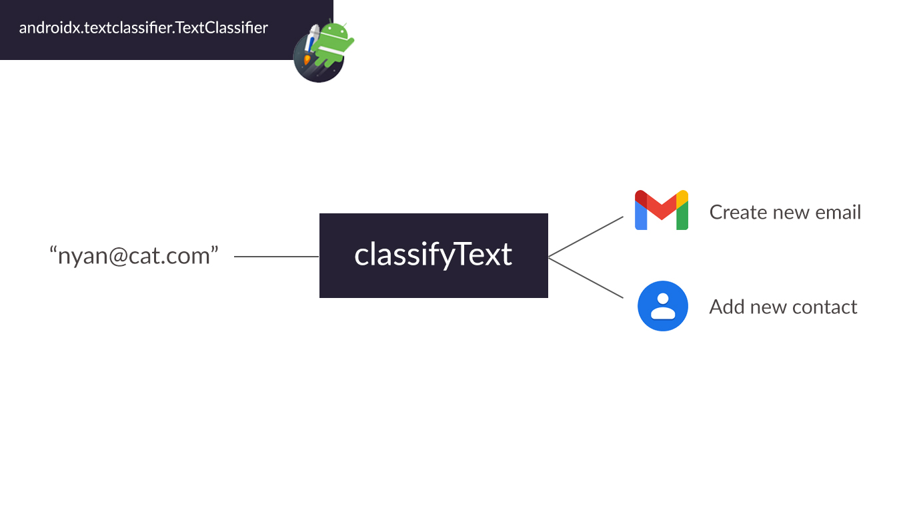
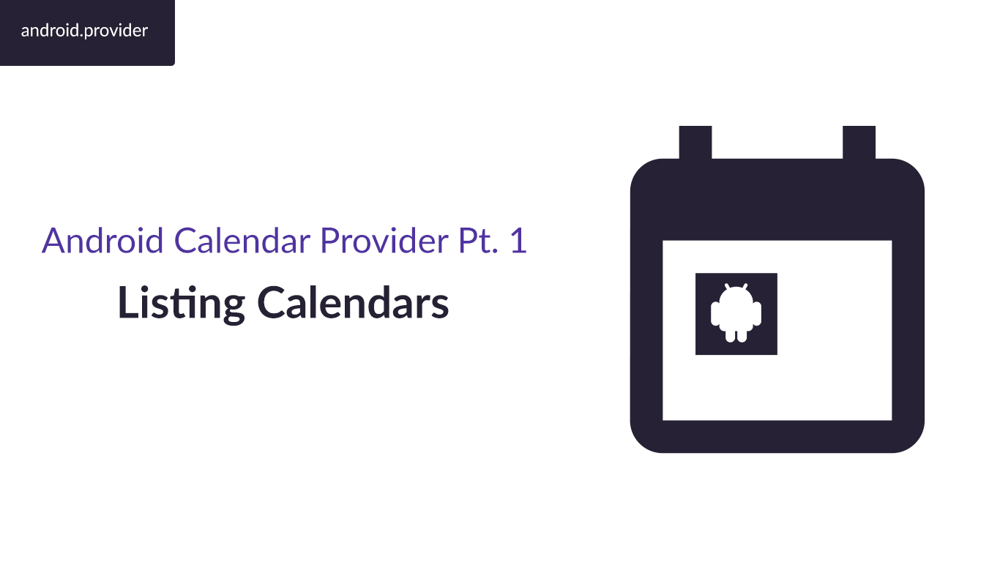
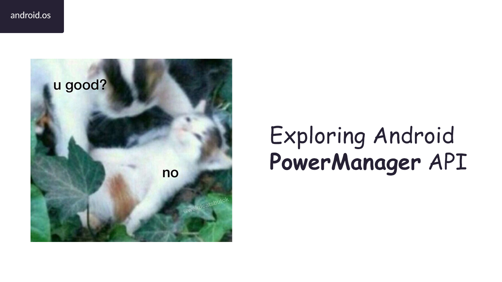
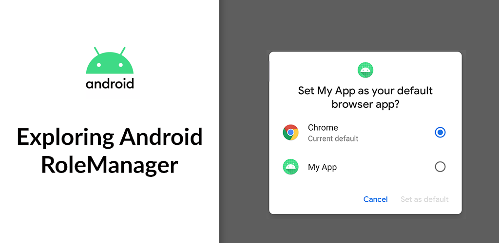
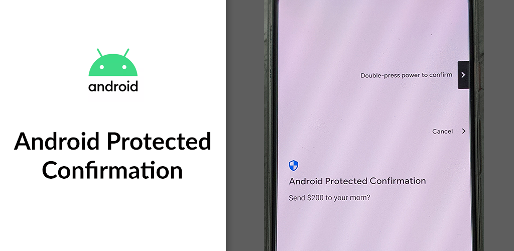
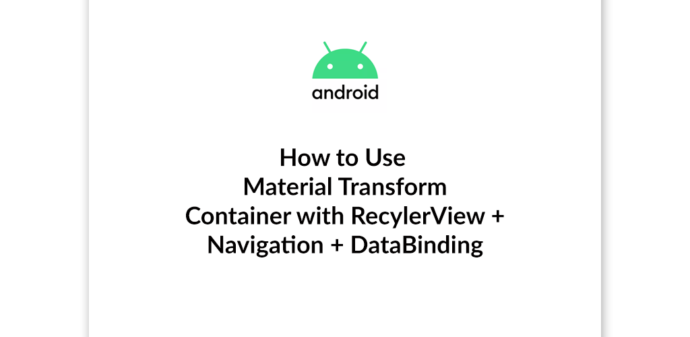

# modern-android-samples

This is the collection of source code for [yggr.medium.com](https://yggr.medium.com).

## Table of Content

| | |
| :-: | :-: |
| Generate Intents based on Input Text with classifyText API ([Github](/classify-text)) ([Tutorial](https://yggr.medium.com/generate-intents-based-on-input-text-with-classifytext-api-6ebdc94c00be)) | Extracting Entities with generateLinks API ([Github](/generate-links)) ([Tutorial](https://yggr.medium.com/extracting-entities-with-generatelinks-api-349042a6e5b0)) |
|  |  |
| Exploring Android's `BatteryManager` API ([Github](/battery-manager)) ([Tutorial](https://yggr.medium.com/exploring-androids-batterymanager-api-8f64951fd9f6)) | Android Calendar Provider ([Github](/calender-provider)) (Tutorial: [Part 1](https://yggr.medium.com/android-calendar-provider-pt-1-listing-calendars-a3b6aeac77d3) [Part 2](https://yggr.medium.com/android-calendar-provider-pt-2-listing-events-2b1c7ca72535)) |
|  |  |
| Android Tips Pt. 1: Try-Catch Navigation, setFragmentResultListener, & SharedPreferences Versioning ([Github](/android-tips-1)) ([Tutorial](https://yggr.medium.com/android-tips-pt-1-try-catch-navigation-setfragmentresultlistener-sharedpreferences-versioning-8b65bc99f14a)) | |
|  | |
| Exploring Android Vibrator API ([Github](/Vibrator)) ([Tutorial](https://yggr.medium.com/exploring-android-vibrator-api-71741c553429)) | Exploring Android PowerManager API ([Github](/power-manager)) ([Tutorial](https://yggr.medium.com/exploring-android-powermanager-api-72981adbafb1)) |
|  |  |
| Exploring Android RoleManager ([Github](/role-manager)) ([Tutorial](https://yggr.medium.com/exploring-android-rolemanager-eac84c611a0b)) | Handling AsyncTask during Screen Rotation ([Github](/async-task)) ([Tutorial](https://yggr.medium.com/handling-asynctask-during-screen-rotation-3eca540af777)) |
|  |  |
| Exploring Android Protected Confirmation ([Github](/android-protected-confirmation)) ([Tutorial](https://yggr.medium.com/exploring-android-protected-confirmation-79b4e5b53af6)) | How to Use Material Container Transform with RecyclerView + Navigation + DataBinding ([Github](/material-list-container-transform)) ([Tutorial](https://yggr.medium.com/how-to-use-material-container-transform-with-recyclerview-navigation-databinding-ee6c13ce26ea)) |
|  |  |
