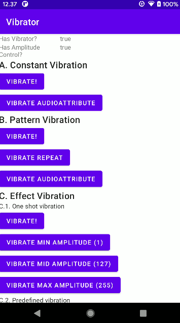

# vibrator

    

This application explores Android [Vibrator](https://developer.android.com/reference/kotlin/android/os/Vibrator) API.

## Tutorial

Link: [Exploring Android Vibrator API](https://yggr.medium.com/exploring-android-vibrator-api-71741c553429)

## Screenshots

| |
| :-: |
| Demo |
|  |
