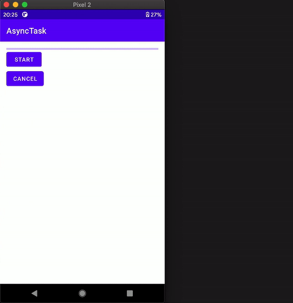

# async-task

    

This application explores [handling AsyncTask during screen rotation](https://stackoverflow.com/questions/7128670/best-practice-asynctask-during-orientation-change).

## Tutorial

Link: [Handling AsyncTask during Screen Rotation](https://yggr.medium.com/handling-asynctask-during-screen-rotation-3eca540af777)

## Screenshots

| |
| :-: |
| Demo |
|  |
