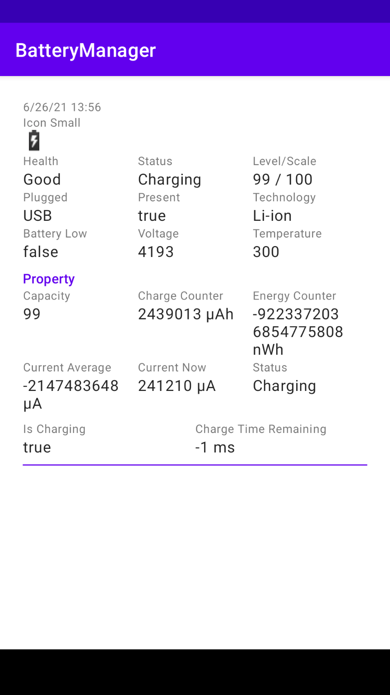

# battery-manager

    

This application explores Android [Battery Manager API](https://developer.android.com/reference/android/os/BatteryManager).

## Tutorial

Link: [Exploring Android's BatteryManager API](https://yggr.medium.com/exploring-androids-batterymanager-api-8f64951fd9f6)

## Screenshots

| |
| :-: |
| Demo |
|  |
