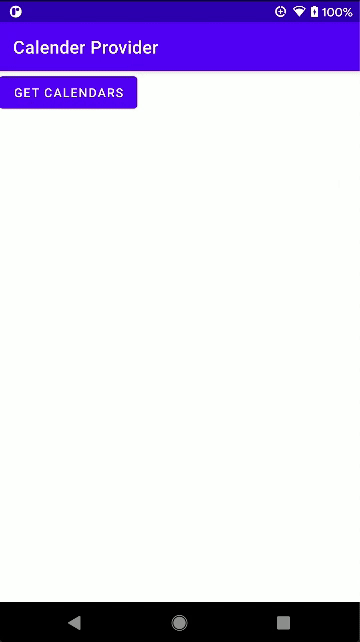

# calender-provider

    

This application explores Android [Calendar Provider API](https://developer.android.com/guide/topics/providers/calendar-provider).

## Tutorial

Link: 

1. Part 1: [Android Calendar Provider Pt. 1: Listing Calendars](https://yggr.medium.com/android-calendar-provider-pt-1-listing-calendars-a3b6aeac77d3)
2. Part 2: [Android Calendar Provider Pt. 2: Listing Events](https://yggr.medium.com/android-calendar-provider-pt-2-listing-events-2b1c7ca72535) 

## Screenshots

| | |
| :-: | :-: |
| Demo Calendar List | Demo Event List |
|  |  |
