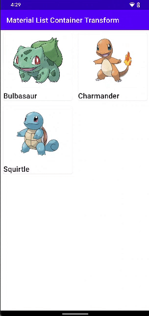

# material-list-container-transform

    

This application explores [Material Container Transform](https://material.io/design/motion/the-motion-system.html#container-transform).

## Tutorial

Link: [How to Use Material Container Transform with RecyclerView + Navigation + DataBinding](https://yggr.medium.com/how-to-use-material-container-transform-with-recyclerview-navigation-databinding-ee6c13ce26ea)

## Screenshots

| |
| :-: |
| Demo |
|  |
