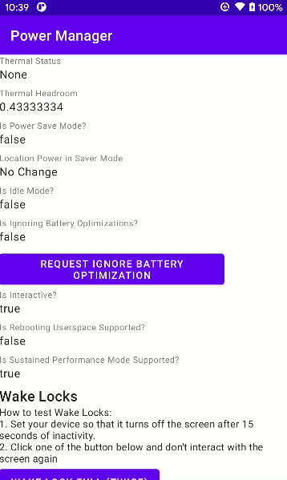

# power-manager

    

This application explores Android [PowerManager](https://developer.android.com/reference/kotlin/android/os/PowerManager?hl=en) API.

## Tutorial

Link: [Exploring Android PowerManager API](https://yggr.medium.com/exploring-android-powermanager-api-72981adbafb1)

## Screenshots

| |
| :-: |
| Demo |
|  |
